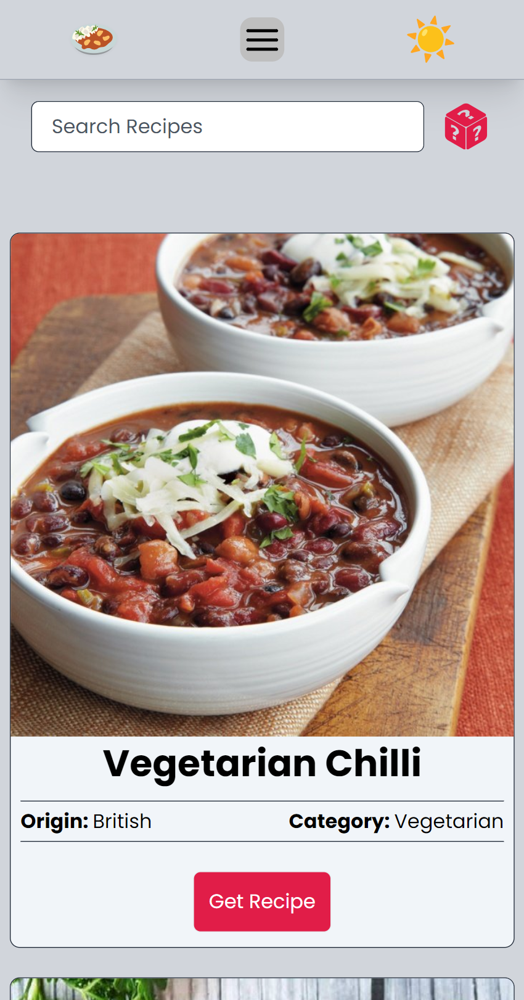

# Flex-Recipe-Hub

## Table of contents

- [Overview](#overview)
  - [Screenshot](#screenshot)
  - [Links](#links)
- [My process](#my-process)
  - [Built with](#built-with)
- [Author](#author)

## Overview

Flex Recipe Hub is more than just a recipe site; it's a journey for the senses, inviting you to savor the world one plate at a time.

### Screenshot

### Links

- Live Site URL: (https://flex-recipe-app.vercel.app/)

## My Process

### Built with

- Vue.js [https://vuejs.org](https://vuejs.org)
    - Pinia [https://pinia.vuejs.org/](https://pinia.vuejs.org/)
- TailwindCSS [https://tailwindcss.com/](https://tailwindcss.com/)
- TheMealDB [https://www.themealdb.com/api.php](https://www.themealdb.com/api.php)
- Axios [https://axios-http.com/](https://axios-http.com/)
- SVG Repo [https://www.svgrepo.com/](https://www.svgrepo.com/)
- Heroicons [https://heroicons.com/](https://heroicons.com/)

## Author

- LinkedIn - https://www.linkedin.com/in/omar-p-graham/
- Frontend Mentor - https://www.frontendmentor.io/profile/omar-p-graham
